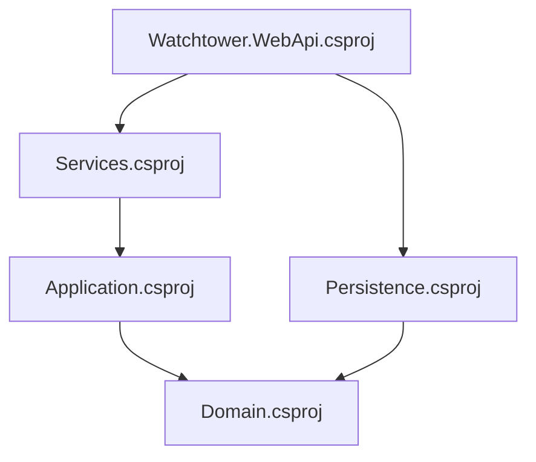

# Watchtower WebApi – Architecture (Onion Architecture)

## ✅ Purpose of this document
Provide a concise, high-level view of the project's Onion Architecture: layer structure, directional dependencies, folder responsibilities, project graph, and a typical request flow.

---
## 🧅 Onion Architecture refresher
Core principles:
- The domain (business core) is central: no outward dependencies.
- Outer layers depend inward, never the reverse.
- Abstractions (interfaces) live in inner layers and are implemented by outer layers.

```
[ Presentation ]  -> depends on ->  Application -> depends on -> Domain
        |                                     ^
        v                                     |
  Infrastructure (concrete implementations)   |
```

---
## 🗂 Layer-mapped structure (Projects vs Folders)

In the tree below, .NET projects (`.csproj`) are marked with the `[Project]` suffix; other entries are internal folders.

```
Watchtower-WebApi.sln                      # Solution
├── ARCHITECTURE.md
├── Core/
│   ├── Domain/                            # Domain layer (core)
│   │   ├── Domain.csproj [Project]
│   │   ├── Entities/
│   │   ├── Abstractions/                  # Repositories, domain event abstractions
│   │   ├── Events/
│   │   ├── Errors/
│   │   ├── Shared/
│   │   └── Shared.Common/
│   │
│   └── Application/                       # Application layer
│       ├── Application.csproj [Project]
│       ├── Abstractions/
│       │   ├── Services/
│       │   ├── Handlers/
│       │   └── Decorators/
│       ├── UseCases/
│       └── Common/
│
├── Infrastructure/
│   ├── Persistence/
│   │   ├── Persistence.csproj [Project]
│   │   ├── DataTables.cs
│   │   ├── Repository/
│   │   └── Events/
│   ├── Services/
│   │   ├── Services.csproj [Project]
│   │   ├── AlertsService.cs
│   │   ├── ClientsService.cs
│   │   ├── ConnectionsService.cs
│   │   ├── ServersService.cs
│   │   └── ServerStatusesService.cs
│
└── Presentation/
    └── Watchtower.WebApi/
        ├── Watchtower.WebApi.csproj [Project]
        ├── Program.cs
        ├── Endpoints/
        ├── Configuration/
        ├── Extensions/
        ├── Middleware/
        ├── Filters/
        ├── Models/
        ├── appsettings*.json
        └── logs/
```

### 🧩 Project list & direct dependencies

| Project | Layer | Project References | Key NuGet dependencies (excerpt) |
|---------|-------|--------------------|----------------------------------|
| `Domain` | Domain | (none) | (none explicit) |
| `Application` | Application | `Domain` | FluentValidation, DTO package, Logging.Abstractions |
| `Persistence` | Infrastructure | `Domain` | MongoDB.Driver, DI.Abstractions |
| `Services` | Infrastructure | `Application` | Mapster, Logging.Abstractions |
| `Watchtower.WebApi` | Presentation | `Persistence`, `Services` | Serilog.*, Swagger/OpenApi |

### 🔗 Dependency graph (Mermaid)



Principle upheld: no inverse dependencies (e.g. Domain does not depend on Application).

---
## 🔌 Typical request flow
Example: GET /api/servers?id=XYZ
1. HTTP call hits an endpoint in `Presentation/Endpoints/ServersEndpoints`.
2. The endpoint parses parameters and builds a query object (e.g. `ServerQuery`).
3. The endpoint invokes an application service interface (e.g. `IServersService`).
4. Concrete implementation (`ServersService`) resolves repositories via DI.
5. Repositories (Infrastructure.Persistence.Repository) query the database (e.g. MongoDB if configured).
6. Domain entities (`Domain.Entities.Server`) are materialized; mapping via Mapster -> DTO (`ServerResponse`).
7. Service enriches response (statuses, connections) and returns it to the endpoint.
8. Middleware (logging / exception) processes cross-cutting concerns.
9. JSON response is returned to the client.

---
## 🧩 Layer responsibilities
- Domain: Business rules, invariants, domain events. No external dependencies. Stable core.
- Application: Orchestrates use cases. Depends only on Domain. Defines service / handler interfaces.
- Infrastructure: Implements abstractions (repositories, concrete services, persistence, logging, mapping). Can depend on external libraries.
- Presentation: Entry point (HTTP API). Configures DI, pipeline, endpoints, serialization.

---
## 🔁 Domain events handling
Folder `Domain/Events` contains events (e.g. `AlertCreatedEvent`). These may be:
- Published in the application via configured handlers (`ConfigureDomainEventHandlers`).
- Used to trigger reactions (notifications, audit, projections, etc.).

---
## 🧪 Validation & Mapping
- Validation: `FluentValidation` registered in `Program.cs` (`AddValidatorsFromAssemblyContaining<Program>()`) + constant messages in `Application/Common/Validation.cs`.
- Mapping: `Mapster` used within services (e.g. `server.Adapt<ServerResponse>()`). Could be centralized via a mapping config.

---
## 🔐 Cross-cutting concerns
- Logging: `Serilog` (enrichers + appsettings configuration)
- CORS / JSON: Extension methods (`ConfigureCors`, `ConfigureJsonOptions`)
- Middleware: `ExceptionHandlingMiddleware`, `EndpointLoggingMiddleware`
- Health checks: `/health`

---
## 🧱 Principles upheld
- Clear separation of concerns.
- Pure Domain (no technical dependencies visible in excerpts).
- Thin application services orchestrating mapping + aggregation.
- Paginated queries via `PagedList<T>` (with metadata).

---
## 🧭 Directional dependencies (simplified)
```
Presentation -> Application -> Domain
         \-> Infrastructure (registers Application.Abstractions implementations)
Infrastructure -> Domain (entities & interfaces)
```
Runtime dependencies are injected via DI at startup (`Program.cs`).


This document can evolve (sequence diagrams, bounded contexts) if needed.

---