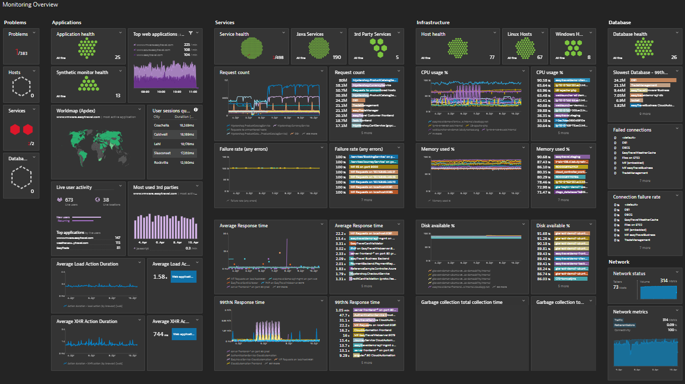

# WatchTower WebApp

This project was generated using [Angular CLI](https://github.com/angular/angular-cli) version 20.1.6.

---

## 🎯 Dashboard Vision

> **The WatchTower dashboard aims to provide a modern, comprehensive monitoring experience inspired by Dynatrace.**  
> The goal is to offer a clear, modular, and interactive overview of your infrastructure, applications, services, and databases, similar to the example below:



*The WatchTower dashboard should, in its main lines, tend towards this type of layout and visualization.*

---

## 🏗️ Project Structure

### 📁 Frontend Architecture (Angular)

```
📦src/
├── 🅰️ app/
│   ├── 🛡️ core/
│   │   ├── 🔧 services/
│   │   │   ├── base-api.service.ts
│   │   │   ├── base-sse.service.ts
│   │   │   ├── storage.service.ts
│   │   │   ├── notification.service.ts
│   │   │   └── error-handler.service.ts
│   │   ├── 📝 models/
│   │   │   ├── base.model.ts
│   │   │   ├── app.model.ts
│   │   │   └── alert.model.ts
│   │   ├── 🛡️ interceptors/
│   │   │   └── http.interceptor.ts
│   │   ├── 🔒 guards/
│   │   │   └── route.guard.ts
│   │   ├── 🛠️ utils/
│   │   │   └── helpers.utils.ts
│   │   └── 📐 constants/
│   │       └── urls.ts
│   │   
│   ├── ✨ features/
│   │   ├── 🖥️ apps/
│   │   │   ├── 🧩 components/
│   │   │   │   ├── 📋 app-list/
│   │   │   │   ├── 🔍 app-detail/
│   │   │   │   └── 📝 app-form/
│   │   │   ├── 📄 pages/
│   │   │   │   ├── apps-page/
│   │   │   │   └── app-details-page/
│   │   │   ├── 🔧 services/
│   │   │   │   └── app.service.ts
│   │   │   ├── 🔍 resolvers/
│   │   │   │   └── app.resolver.ts
│   │   │   └── apps.routes.ts
│   │   ├── ⚠️ alerts/
│   │   │   ├── 🧩 components/
│   │   │   │   ├── 📋 alert-list/
│   │   │   │   ├── 🔍 alert-detail/
│   │   │   │   └── 📝 alert-form/
│   │   │   ├── 📄 pages/
│   │   │   │   ├── alerts-page/
│   │   │   │   └── alert-details-page/
│   │   │   ├── 🔧 services/
│   │   │   │   └── alert.service.ts
│   │   │   ├── 🔍 resolvers/
│   │   │   │   └── alert.resolver.ts
│   │   │   └── alerts.routes.ts
│   │   └── 📊 dashboard/
│   │       ├── 🧩 components/
│   │       │   ├── dashboard-overview/
│   │       │   └── dashboard-chart/
│   │       ├── 📄 pages/
│   │       │   └── dashboard-page/
│   │       └── dashboard.routes.ts
│   ├── 🤝 shared/
│   │   ├── 🧩 components/
│   │   │   ├── table/
│   │   │   ├── dialog/
│   │   │   ├── loading/
│   │   │   ├── pagination/
│   │   │   ├── header/
│   │   │   ├── sidebar/
│   │   │   └── footer/
│   │   ├── 🔄 pipes/
│   │   │   └── common.pipe.ts
│   │   ├── 📌 directives/
│   │   │   └── common.directive.ts
│   │   ├── validators.ts
│   │   ├── material.module.ts
│   │   └── enums.ts
│   ├── 🏗️ layouts/
│   │   ├── main-layout/
│   │   └── auth-layout/
│   ├── app.config.ts
│   ├── app.routes.ts
│   ├── app.component.ts
│   ├── app.component.html
│   └── app.component.scss
├── 📁 assets/
│   ├── icons/
│   ├── images/
│   └── 🎨 styles/
│       └── main.scss
└── 🌍 environments/
    ├── environment.ts
    └── environment.prod.ts
```

### 🎯 Architecture Principles

#### **Core Module**
- **Singleton services** for application-wide functionality
- **Base models** and shared interfaces
- **HTTP interceptors** for API communication
- **Route guards** for authentication and authorization
- **Utility functions** and constants

#### **Features Module (Vertical Slices)**
- **Self-contained feature modules** with their own components, services, and routes
- **Components** for UI logic and presentation
- **Pages** for route-level components
- **Services** for business logic and API communication
- **Resolvers** for data fetching before route activation

#### **Shared Module**
- **Reusable components** across multiple features
- **Common pipes and directives**
- **Form validators**
- **Material Design integration**

#### **Layouts**
- **Main layout** for authenticated users
- **Auth layout** for login/registration pages

### ✅ Benefits

- **Scalability**: Easy to add new features without affecting existing ones
- **Maintainability**: Clear separation of concerns
- **Reusability**: Shared components and services
- **Testing**: Isolated modules for better test coverage
- **Development**: Multiple developers can work on different features simultaneously

## 🚀 Development

### Development app

To start a local development server, run:

```bash
ng serve
```

Once the server is running, open your browser and navigate to `http://localhost:4200/`. The application will automatically reload whenever you modify any of the source files.

### Code scaffolding

Angular CLI includes powerful code scaffolding tools. To generate a new component, run:

```bash
ng generate component component-name
```

For a complete list of available schematics (such as `components`, `directives`, or `pipes`), run:

```bash
ng generate --help
```

### Building

To build the project run:

```bash
ng build
```

This will compile your project and store the build artifacts in the `dist/` directory. By default, the production build optimizes your application for performance and speed.

## 🧪 Testing

### Running unit tests

To execute unit tests with the [Karma](https://karma-runner.github.io) test runner, use the following command:

```bash
ng test
```

### Running end-to-end tests

For end-to-end (e2e) testing, run:

```bash
ng e2e
```

Angular CLI does not come with an end-to-end testing framework by default. You can choose one that suits your needs.

## 📚 Additional Resources

For more information on using the Angular CLI, including detailed command references, visit the [Angular CLI Overview and Command Reference](https://angular.dev/tools/cli)
